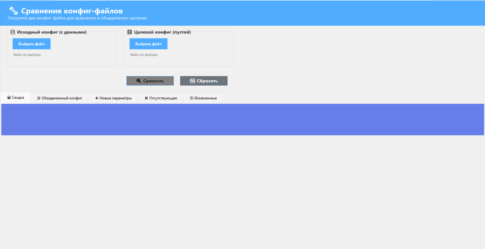
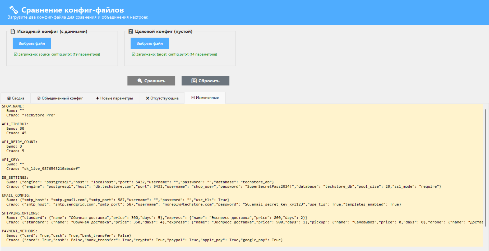
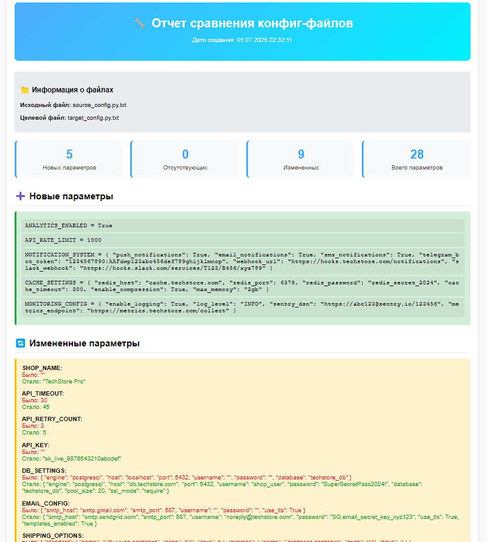

# 🔧 Config Merger

**Мощный инструмент для сравнения и объединения конфигурационных файлов**

[](https://opensource.org/licenses/MIT)
[](https://dotnet.microsoft.com/download/dotnet-framework)
[](https://www.microsoft.com/windows)


## 📋 Описание

Config Merger — это Windows-приложение для сравнения, анализа и объединения конфигурационных файлов. Идеально подходит для разработчиков, системных администраторов и DevOps-инженеров, работающих с различными конфигурациями.

### ✨ Основные возможности

- 🔍 **Интеллектуальное сравнение** конфиг-файлов с автоочисткой дубликатов
- 📊 **Детальная аналитика** изменений с цветовым кодированием
- 💾 **Множественные форматы экспорта** (HTML, TXT, CSV)
- 🎯 **Гибкие опции сохранения** результатов
- 🖱️ **Drag & Drop** поддержка для удобства использования
- 🎨 **Современный интерфейс** с профессиональным дизайном

## 🚀 Быстрый старт

### Системные требования

- **ОС**: Windows 7/8/10/11
- **.NET Framework**: 4.5 или выше
- **ОЗУ**: минимум 512 МБ
- **Место на диске**: 50 МБ

### Установка

1. Скачайте последний релиз из [Releases](../../releases)
2. Распакуйте архив в удобную папку
3. Запустите `ConfigMerger.exe`

### Использование

1. **Загрузите файлы**: Перетащите файлы в окна или используйте кнопки "Выбрать файл"
2. **Сравните**: Нажмите кнопку "🔍 Сравнить файлы" 
3. **Анализируйте**: Изучите результаты во вкладках
4. **Сохраните**: Используйте кнопки сохранения для экспорта результатов

## 📸 Скриншоты


*Главный интерфейс приложения*


*Детальные результаты сравнения*


*Пример HTML отчета*

## 🛠️ Функциональность

### Сравнение файлов
- ✅ Автоматическое удаление дубликатов
- ✅ Поддержка многострочных блоков (словари, списки)
- ✅ Умный парсинг Python конфигов
- ✅ Сохранение структуры и комментариев

### Анализ изменений
- 📈 **Новые параметры** — добавленные в исходном файле
- 📉 **Отсутствующие параметры** — отсутствующие в исходном файле  
- 🔄 **Измененные параметры** — с разными значениями
- 📊 **Статистика** — общее количество изменений

### Экспорт и сохранение
- 📄 **HTML отчет** — красивый веб-отчет с дизайном
- 📝 **TXT отчет** — простой текстовый формат
- 📊 **CSV отчет** — для анализа в Excel
- 💾 **Сохранение как...** — произвольное имя файла
- 📁 **Сохранить как целевой** — с именем исходного файла
- ⚡ **Быстрое сохранение** — замена оригинального файла

## 🎯 Применение

### Для разработчиков
- Сравнение конфигов между версиями
- Миграция настроек между окружениями
- Анализ изменений в конфигурационных файлах

### Для системных администраторов
- Управление конфигурациями серверов
- Контроль изменений в настройках
- Документирование конфигураций

### Для DevOps
- Автоматизация развертывания
- Контроль конфигураций в CI/CD
- Аудит настроек инфраструктуры

## 🔧 Сборка из исходного кода

### Требования для разработки
- Visual Studio 2019 или выше
- .NET Framework 4.5+ SDK

### Инструкции
```bash
git clone https://github.com/ANHELL-dev/config-merger.git
cd config-merger
```

Откройте `ConfigMerger.sln` в Visual Studio и нажмите F5 для запуска.

## 📁 Структура проекта

```
ConfigMerger/
├── MainForm.cs              # Основная логика приложения
├── MainForm.Designer.cs     # Дизайн интерфейса
├── Program.cs               # Точка входа
├── Properties/              # Настройки проекта
└── README.md               # Документация
```

## 🤝 Вклад в разработку

Мы приветствуем вклад в развитие проекта! 

### Как помочь
1. 🍴 Форкните репозиторий
2. 🌿 Создайте ветку для новой функции (`git checkout -b feature/amazing-feature`)
3. 💻 Внесите изменения и протестируйте
4. 📝 Сделайте коммит (`git commit -m 'Add some amazing feature'`)
5. 📤 Запушьте в ветку (`git push origin feature/amazing-feature`)
6. 🔄 Откройте Pull Request

### Сообщения об ошибках
Если вы нашли баг, пожалуйста [создайте issue](../../issues/new) с подробным описанием:
- Шаги для воспроизведения
- Ожидаемое поведение
- Фактическое поведение
- Скриншоты (если применимо)

## 📄 Лицензия

Этот проект распространяется под лицензией MIT. Подробности в файле [LICENSE](LICENSE).

## 📞 Контакты

- 📧 **Email**: anhell.corp@gmail.com
- 💬 **Telegram**: @ANHEL_L

## 🎉 Поддержите проект

Если проект оказался полезным, поставьте ⭐ звезду на GitHub!

---

<p align="center">
  <strong>Сделано с ❤️ для сообщества разработчиков</strong>
</p>
