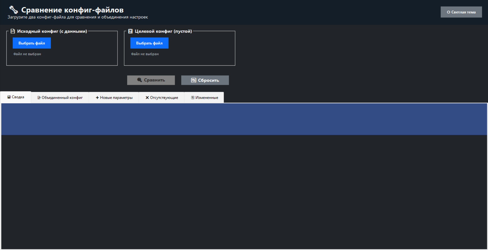

# 🔧 Config Merger

**Мощный инструмент для сравнения и объединения конфигурационных файлов**

[](https://opensource.org/licenses/MIT)
[](https://dotnet.microsoft.com/download/dotnet-framework)
[](https://www.microsoft.com/windows)
[](../../releases)

## 📋 Описание

Config Merger — это профессиональное Windows-приложение для сравнения, анализа и объединения конфигурационных файлов различных форматов. Идеально подходит для разработчиков, системных администраторов и DevOps-инженеров, работающих с комплексными конфигурациями.

### ✨ Основные возможности

- 🔍 **Интеллектуальное сравнение** конфиг-файлов с автоочисткой дубликатов
- 📊 **Мультиформатная поддержка**: Python, YAML, JSON, XML
- 🎨 **Темная/светлая тема** с современным Material Design
- 📈 **Детальная аналитика** изменений с цветовым кодированием
- 💾 **Множественные форматы экспорта** (HTML, TXT, CSV)
- 🎯 **Гибкие опции сохранения** с автобэкапом
- 🖱️ **Drag & Drop** поддержка для удобства использования
- ⚡ **Высокая производительность** с современным C# 10

## 🚀 Быстрый старт

### Системные требования

- **ОС**: Windows 7 SP1 / 8.1 / 10 / 11
- **.NET Framework**: 4.7.2 или выше
- **ОЗУ**: минимум 256 МБ
- **Место на диске**: 50 МБ

### Установка

1. Скачайте последний релиз из [Releases](../../releases)
2. Распакуйте архив в удобную папку
3. Запустите `ConfigMerger.exe`

### Использование

1. **Загрузите файлы**: Перетащите файлы в окна или используйте кнопки "Выбрать файл"
2. **Сравните**: Нажмите кнопку "🔍 Сравнить файлы" 
3. **Анализируйте**: Изучите результаты во вкладках
4. **Сохраните**: Используйте расширенные опции сохранения

## 🆕 Что нового в версии 2.0

### Новые форматы
- ✅ **YAML/YML** - полная поддержка с сохранением структуры
- ✅ **JSON** - интеллектуальный парсинг вложенных объектов
- ✅ **XML** - обработка атрибутов и сложных структур

### Улучшенный интерфейс
- 🎨 **Темная тема** с профессиональным дизайном
- ⚡ **Быстрое переключение тем** одной кнопкой
- 📱 **Адаптивный интерфейс** с улучшенной навигацией


## 📸 Скриншоты


*Обновленный главный интерфейс с поддержкой тем*


*Современная темная тема*


*Профессиональный HTML отчет*

## 🛠️ Поддерживаемые форматы

### Python (.py)
- ✅ Автоматическая очистка дубликатов
- ✅ Поддержка многострочных блоков (словари, списки)
- ✅ Сохранение комментариев и структуры
- ✅ Умный парсинг переменных окружения

### YAML (.yaml, .yml)
- ✅ Полная поддержка YAML 1.2
- ✅ Обработка вложенных структур
- ✅ Поддержка массивов и объектов
- ✅ Сохранение отступов и комментариев

### JSON (.json)
- ✅ Валидация JSON структуры
- ✅ Обработка вложенных объектов и массивов
- ✅ Автоформатирование с отступами
- ✅ Поддержка различных типов данных

### XML (.xml)
- ✅ Парсинг атрибутов и элементов
- ✅ Обработка пространств имен
- ✅ Сохранение иерархии
- ✅ Поддержка CDATA секций

## 📊 Функциональность

### Анализ изменений
- 📈 **Новые параметры** — добавленные в исходном файле
- 📉 **Отсутствующие параметры** — отсутствующие в исходном файле  
- 🔄 **Измененные параметры** — с детальным сравнением значений
- 📊 **Интерактивная статистика** — с графическим представлением

### Экспорт и сохранение
- 📄 **HTML отчет** — профессиональный веб-отчет с современным дизайном
- 📝 **TXT отчет** — структурированный текстовый формат
- 📊 **CSV отчет** — для анализа в Excel и других инструментах
- 💾 **Сохранение как...** — с поддержкой всех форматов
- 📁 **Сохранить как целевой** — с автоопределением формата
- ⚡ **Быстрое сохранение** — с автобэкапом оригинала

## 🎯 Применение

### Для разработчиков
- Миграция конфигов между микросервисами
- Сравнение настроек Development/Staging/Production
- Анализ изменений в API конфигурациях
- Объединение конфигов при слиянии веток

### Для системных администраторов
- Управление конфигурациями серверов и сервисов
- Аудит изменений в системных настройках
- Синхронизация конфигураций между серверами
- Документирование инфраструктуры

### Для DevOps инженеров
- Автоматизация развертывания с проверкой конфигов
- Управление Kubernetes ConfigMaps и Secrets
- Контроль конфигураций в CI/CD пайплайнах
- Мониторинг drift-а конфигураций

## 🔧 Сборка из исходного кода

### Требования для разработки
- Visual Studio 2019+ или VS Code
- .NET Framework 4.7.2+ SDK
- C# 10 Language Support

### Зависимости
- `Newtonsoft.Json 13.0.3` - для обработки JSON

### Инструкции
```bash
git clone https://github.com/ANHELL-dev/config-merger.git
cd config-merger
```

Откройте `Config Merger.sln` в Visual Studio и нажмите F5 для запуска.

## 📁 Архитектура проекта

```
ConfigMerger/
├── Program.cs                    # Точка входа приложения
├── MainForm.cs                   # Основная логика и UI
├── MainForm.Designer.cs          # Автогенерируемый дизайн
├── ThemeManager.cs              # Система тем и стилизации
├── ConfigParserFactory.cs       # Фабрика парсеров
├── JsonConfigParser.cs          # Парсер JSON
├── YamlConfigParser.cs          # Парсер YAML
├── XmlConfigParser.cs           # Парсер XML
├── Settings.cs                  # Настройки приложения
└── Properties/                  # Метаданные проекта
```

## 🤝 Вклад в разработку

Мы приветствуем вклад в развитие проекта! 

### Как помочь
1. 🍴 Форкните репозиторий
2. 🌿 Создайте ветку для новой функции (`git checkout -b feature/amazing-feature`)
3. 💻 Внесите изменения и протестируйте
4. 📝 Сделайте коммит (`git commit -m 'Add some amazing feature'`)
5. 📤 Запушьте в ветку (`git push origin feature/amazing-feature`)
6. 🔄 Откройте Pull Request

### Планы развития
- [ ] Поддержка TOML формата
- [ ] Интеграция с Git для отслеживания изменений
- [ ] REST API для автоматизации
- [ ] Плагинная архитектура для пользовательских парсеров
- [ ] Консольная версия для CI/CD

### Сообщения об ошибках
Если вы нашли баг, пожалуйста [создайте issue](../../issues/new) с подробным описанием:
- Шаги для воспроизведения
- Ожидаемое поведение
- Фактическое поведение
- Информация о системе
- Скриншоты (если применимо)

## 📄 Лицензия

Этот проект распространяется под лицензией MIT. Подробности в файле [LICENSE](LICENSE.txt).

```
MIT License

Разрешается безвозмездное использование, копирование, изменение и распространение
с сохранением уведомления об авторских правах.
```

## 📞 Контакты

- 📧 **Email**: anhell.corp@gmail.com
- 💬 **Telegram**: @ANHEL_L
- 🐛 **Issues**: [GitHub Issues](../../issues)
- 💡 **Feature Requests**: [Discussions](../../discussions)

## 🎉 Поддержите проект

Если проект оказался полезным:
- ⭐ Поставьте звезду на GitHub
- 🔄 Поделитесь с коллегами
- 🐛 Сообщите об ошибках
- 💡 Предложите улучшения

---

<p align="center">
  <strong>Сделано с ❤️ для сообщества разработчиков</strong><br>
  <sub>Config Merger v2.0 - Configuration Management Tool</sub>
</p>
